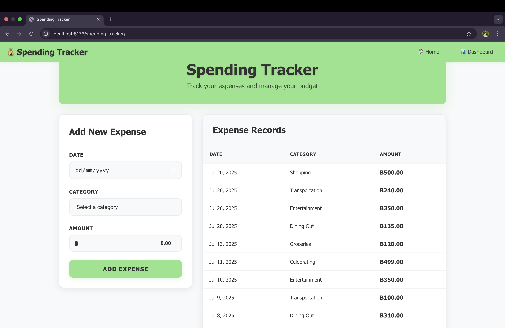
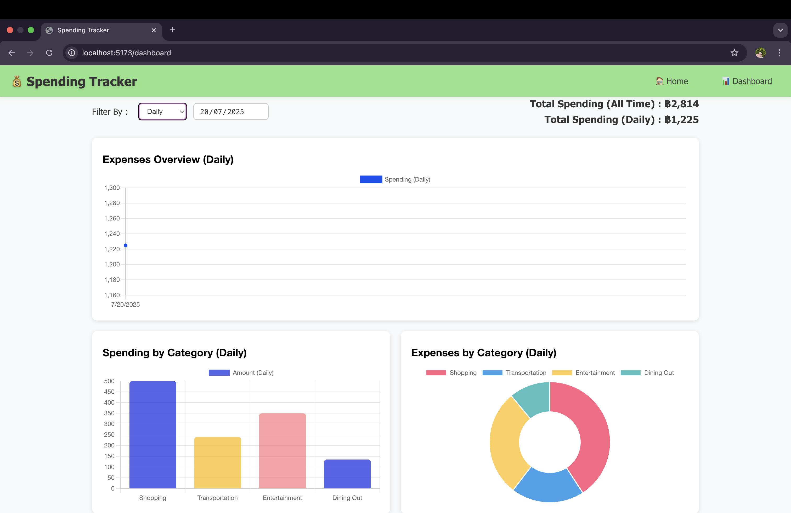
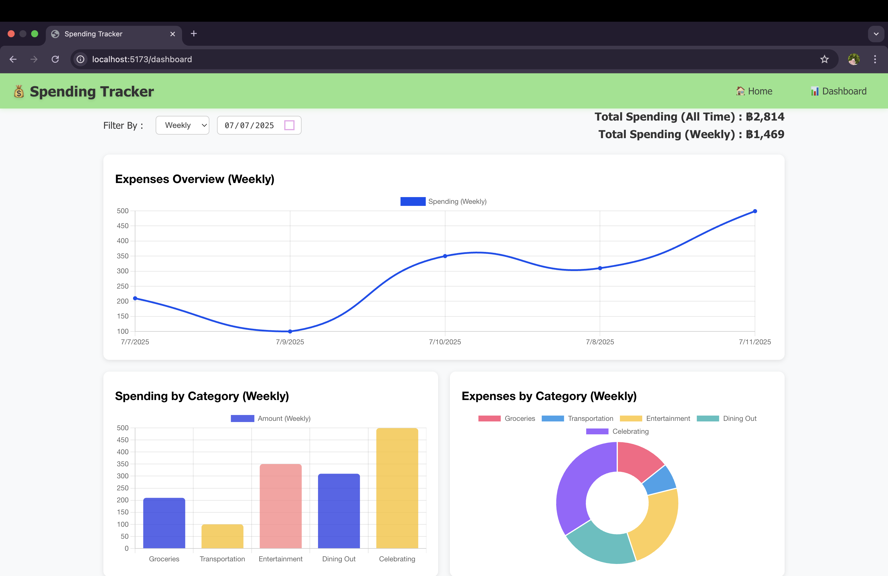
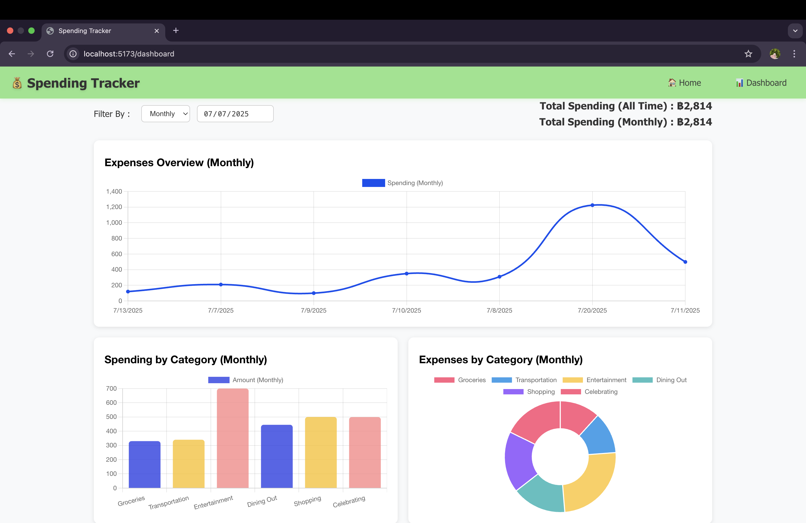

# 💰 Spending Tracker

A simple React-based expense tracking application built with Vite. Track your daily expenses with predefined categories or create custom ones, and visualize your spending patterns with interactive charts.

## ✨ Features

- **Add Expenses**: Record expenses with date, category, and amount (Thai Baht ฿)
- **Predefined Categories**: 10 built-in categories (Food, Transportation, Shopping, etc.)
- **Custom Categories**: Add "Other" category with custom names
- **Expense History**: View all expenses sorted by date
- **Visual Dashboard**: Interactive charts showing spending by category and trends
- **Local Storage**: Data persists in browser localStorage

## 🚀 Quick Start

1. **Install dependencies**

   ```bash
   pnpm install
   ```

2. **Start development server**

   ```bash
   pnpm dev
   ```

3. **Open your browser**
   Navigate to `http://localhost:5173`

## 🛠️ Built With

- **React 19** - UI framework
- **Vite** - Build tool and dev server
- **React Hook Form** - Form handling
- **Chart.js** - Data visualization
- **React Router** - Navigation

## 📱 Pages

- **Home** (`/spending-tracker`) - Add new expenses and view records table
  
- **Dashboard** (`/dashboard`) - View spending analytics and charts
   - Filter By Daily 
     
   - Filter By Weekly 
     
   - Filter By Monthly 
     

## 💾 Data Storage

All expense data is stored in browser localStorage. No external database required.


## 🤝Team Members
- Thu Yein
- Sai Zin Min Khant
- Hsu Yee Mon
